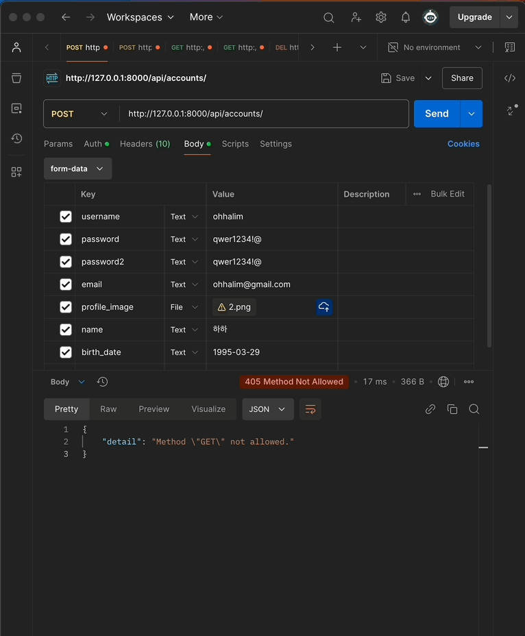
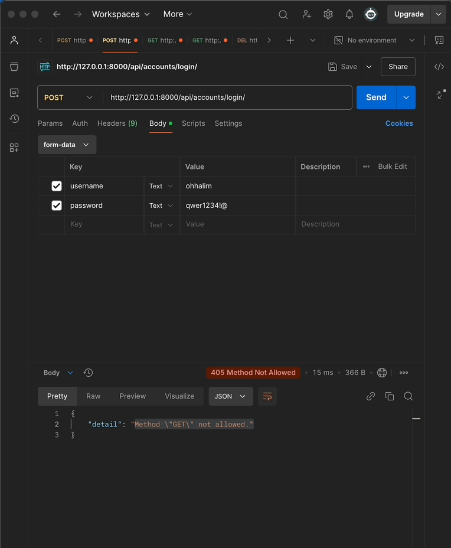
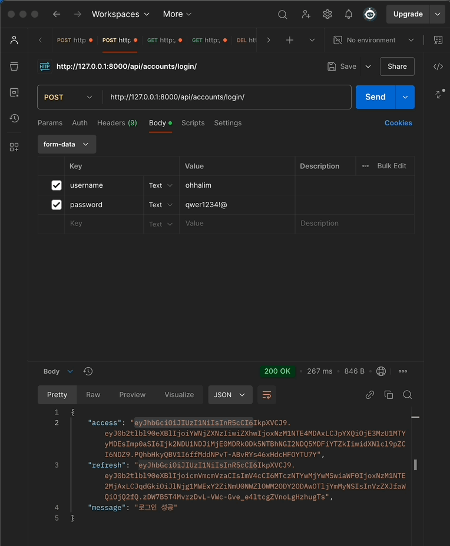
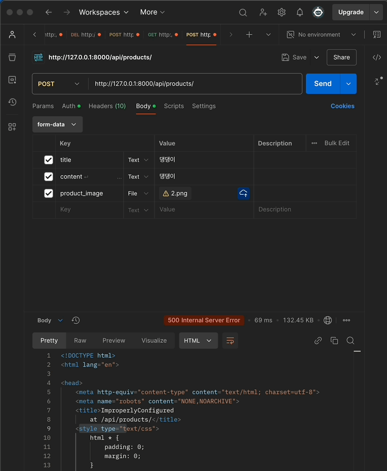
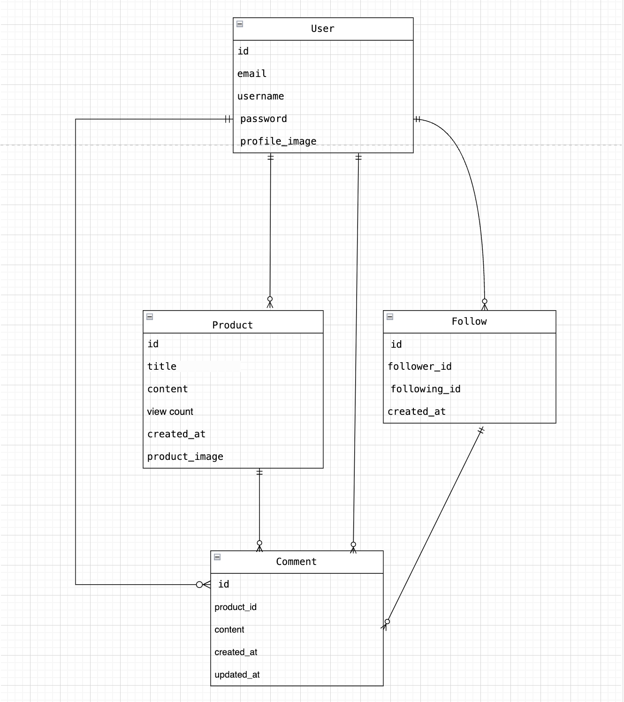

#  아직 미완성입니다!!! ..프로젝트 스파르타 마켓 DRF 

## 📖 목차 
1. [프로젝트 소개](#프로젝트-소개) 
2. [설치 방법](#설치-방법)
3. [주요기능](#주요기능) 
4. [시연](#시연)
5. [기술스택](#기술스택) 
5. [Trouble Shooting](#trouble-shooting)
6. [확장성](#확장성)

## 프로젝트 소개

스파르타 마켓은 장고 기반의 웹 애블리케이션으로, 사용자들이 상품을 등록하고 서로 팔로우할 수 있는 마켓 플레이스입니다.

<br>

## 설치 방법

1. **클론하기**

    ```bash
    git clone https://github.com/yourusername/spartamarket.git
    cd spartamarket
    ```

2. **가상 환경 설정**

    ```bash
    python -m venv venv
    source venv/bin/activate
    ```

3. **필수 패키지 설치**

    ```bash
    pip install -r requirements.txt
    ```

4. **데이터베이스 마이그레이션**

    ```bash
    python manage.py makemigrations
    python manage.py migrate
    ```

5. **슈퍼유저 생성**

    ```bash
    python manage.py createsuperuser
    ```

6. **개발 서버 실행**

    ```bash
    python manage.py runserver
    ```

7. **접속하기**

    브라우저에서 [http://127.0.0.1:8000/products/](http://127.0.0.1:8000/products/)에 접속합니다.


<br>

## 주요기능
- 사용자 가입 및 로그인
- 프로필 편집 및 팔로우 기능
- 상품 등록, 수정, 삭제
- 상품 좋아요(찜) 기능

<br>

##  시연
> #### 사용자 가입 및 로그인

<br>

> #### 프로필 편집

<br>

> #### 상품 등록

<br>

> #### 상품 좋아요(찜) 



<br>

##  기술스택

### ✔️ Language
 `python` `css` `html`  

### ✔️ IDE
`Visual Studio`

### ✔️ Framework
`django` `bootstrap`

### ✔️ ERD


<br>

## Trouble Shooting

◻ 프로필에 내 상품, 내 찜이 뜨지 않음 > 해결방법: url, views, templates 순으로 확인하고 문제점을 찾아 해결함

<br>

## 확장성
◻ drf 활용으로 배포 할 수 있다


