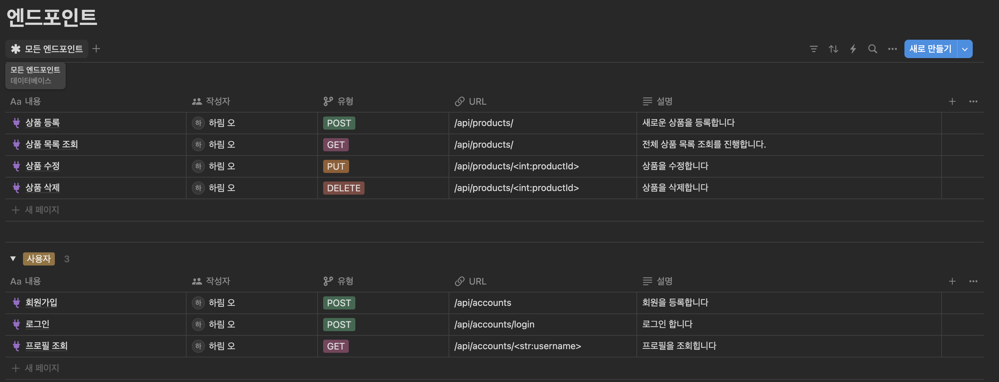
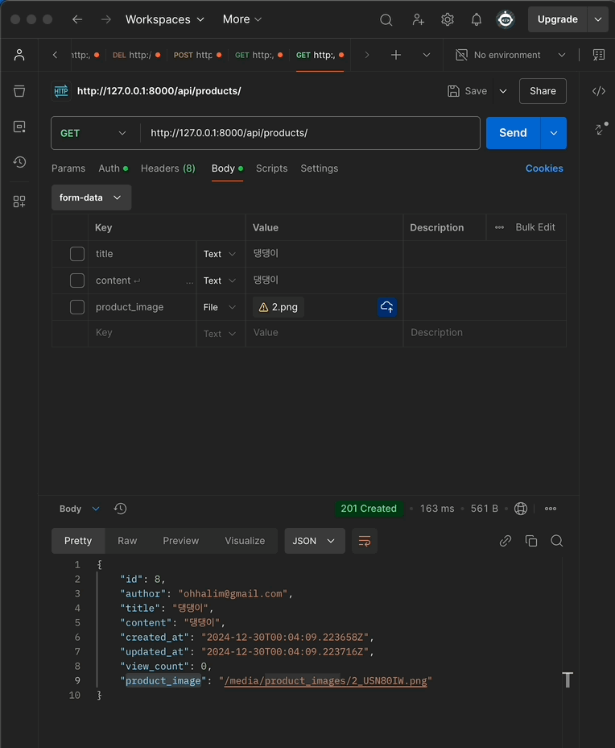
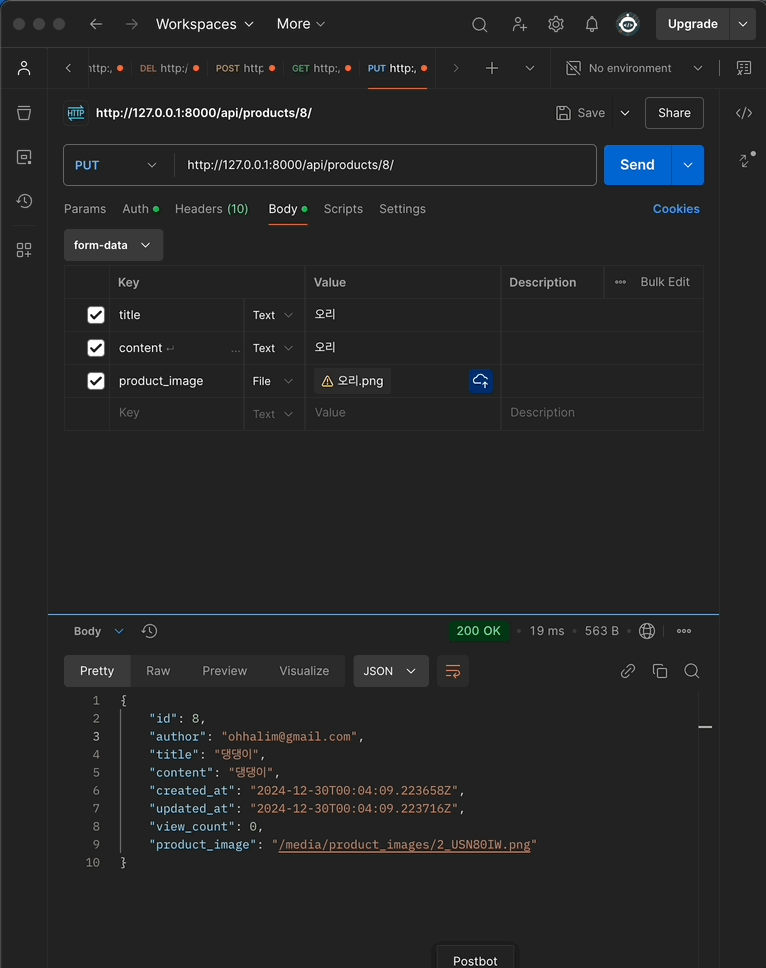
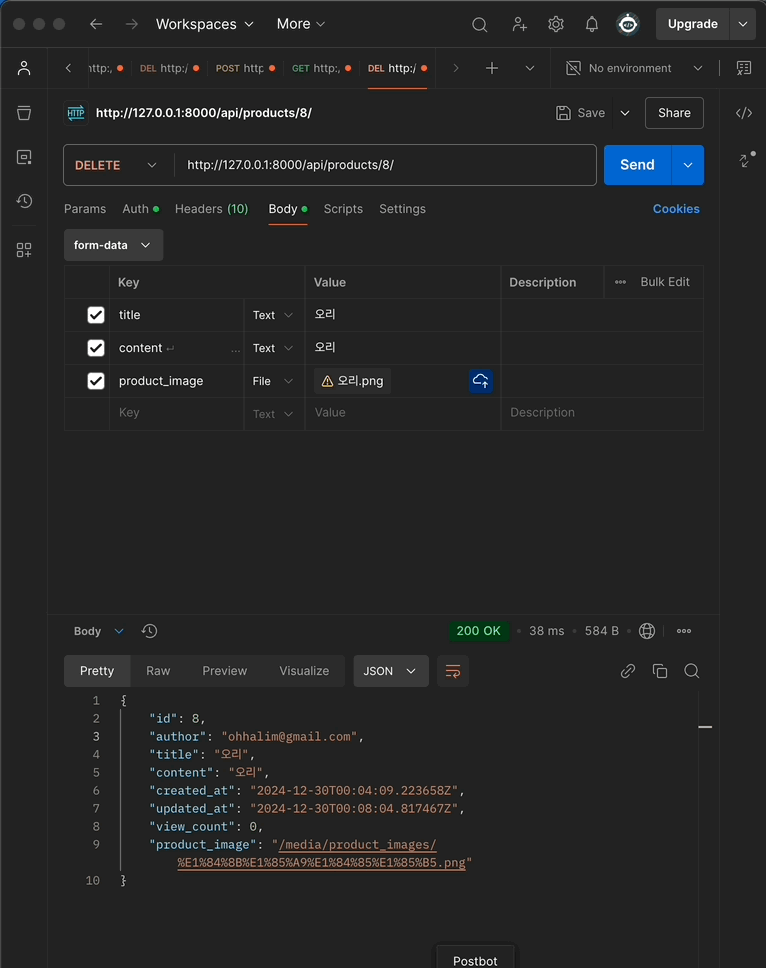

#  프로젝트 스파르타 마켓 DRF 

## 📖 목차 
1. [프로젝트 소개](#프로젝트-소개) 
2. [설치 방법](#설치-방법)
3. [앤드포인트](#앤드포인트)
4. [주요기능](#주요기능) 
5. [시연](#시연)
6. [기술스택](#기술스택) 
7. [Trouble Shooting](#trouble-shooting)
6. [확장성](#확장성)

## 프로젝트 소개

스파르타 마켓은  Django Rest Framework를 활용한 API 시스템입니다. 

<br>

## 설치 방법

1. **클론하기**

    ```bash
    git clone https://github.com/yourusername/spartamarket.git
    cd spartamarket
    ```

2. **가상 환경 설정**

    ```bash
    python -m venv venv
    source venv/bin/activate
    ```

3. **필수 패키지 설치**

    ```bash
    pip install -r requirements.txt
    ```

4. **데이터베이스 마이그레이션**

    ```bash
    python manage.py makemigrations
    python manage.py migrate
    ```

5. **슈퍼유저 생성**

    ```bash
    python manage.py createsuperuser
    ```

6. **개발 서버 실행**

    ```bash
    python manage.py runserver
    ```

7. **접속하기**

    포스트맨에서 [http://127.0.0.1:8000/](http://127.0.0.1:8000/)에 접속합니다.
<br>


## 앤드포인트
https://www.notion.so/167e4fdf7114800486c9c355f89cd655?v=167e4fdf711481cfb6c6000c79fbda05



<br>

## 주요기능
- 사용자 가입 및 로그인
- 프로필 편집 및 팔로우 기능
- 상품 등록, 수정, 삭제
- 상품 서치

<br>

##  시연
> #### 사용자 가입 

<br>

> #### 사용자 로그인

<br>

> #### 프로필 조회

<br>

> #### 상품 등록

<br>

> #### 상품 목록 조회

<br>

> #### 상품 수정

<br>

#### 상품 삭제

<br>

##  기술스택

### ✔️ Language
 `python` `css` `html` 

### ✔️ IDE
`Visual Studio`

### ✔️ Framework
`django` `Django Rest Framework` 

### ✔️ ERD


<br>

## Trouble Shooting

◻ 장고에서 만들었던 프로젝트를 발전 시켜서 만들려했지만 실패함 > 특강자료를 참고해서 만들었음

<br>

## 확장성
◻ 클리우드 서버를 연결해 배포 할 수 있다


